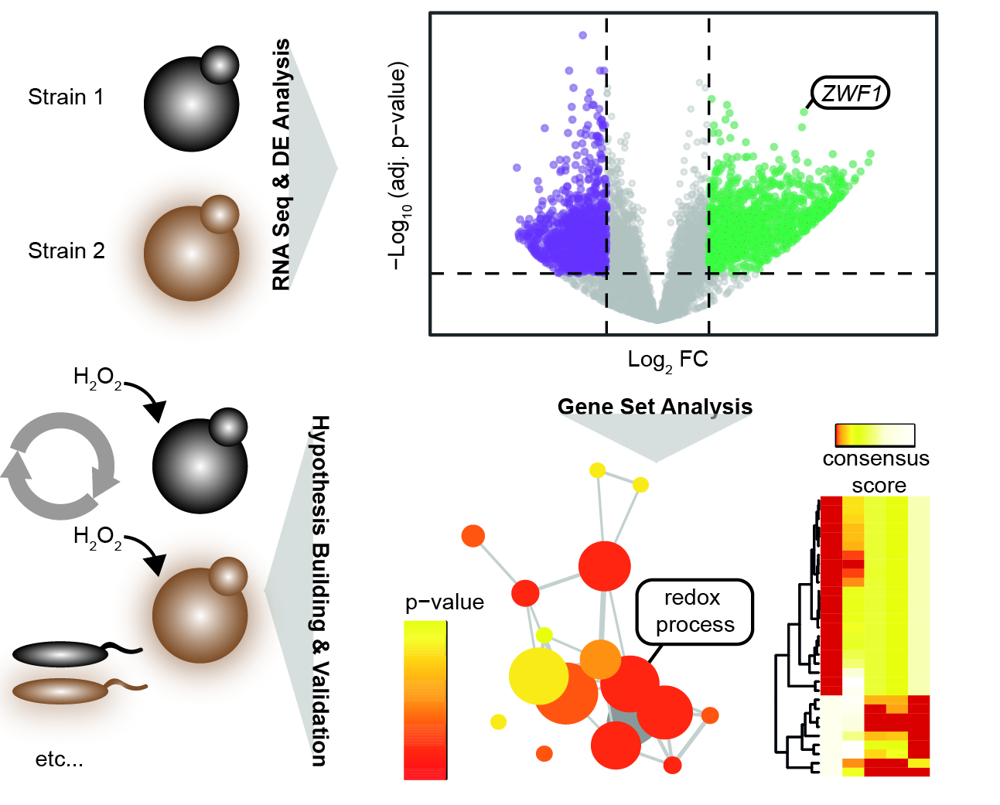

<style type="text/css">

blockquote {
  background: #ECF8FF;
  border-left: 10px solid #3989CB;
  margin: 1.5em 10px;
  padding: 0.5em 10px;
  font-size: 14px;
}

h1 { 
  font-size: 25px;
  margin-top: 1.5cm;
  margin-bottom: 0.5cm;
}
h2 { 
  font-size: 18px;
  margin-top: 1cm;
  margin-bottom: 0.5cm;
}
h3 {
  font-size: 14px;
  margin-top: 1cm;
  margin-bottom: 0.5cm;
}

table.answer, td.answer {
   border: 0px;
   background: #BCE0C0;
   padding: 10px;
   width: 100%;
}

div.answer { display: true;}

</style>


```{r setup, include=F}
knitr::opts_chunk$set(echo = TRUE, tidy=F, eval=T, cache=F)
qn <- sn <- 0
```

Introduction
===================

Gene set analysis (GSA) is a commonly used approach for interpreting big omic data, whereby genes are aggregated into gene sets on the basis of their shared biological or functional properties, defined by a reference knowledge base. Usually, the aim of GSA is to interpret cell behaviour (the "how"), and from that, generate a hypothesis for what the mechanism is behind the cell's behaviour (the "why"). These hypotheses can then be tested in replication studies and other independent laboratory experiments to validate them (Figure 1).


```{r pressure, echo=FALSE, fig.cap="**Figure 1**", out.width = '75%', fig.align='center'}

```


R environment setup
===================

The data needed for this exercise are the results from the previous differential expression analysis exercise, using the gene counts from glucose conditions (saved as `DE_results_glucose.txt` in the `data/DE_results/` subdirectory within the `IDA_tutorial` directory).

`r sn<-sn+1; paste(sn,". ", sep="")` Load the R packages that will be used in this exercise:
```{r, message=FALSE, warning=FALSE, results='hide'}
library(knitr)
library(piano)
library(pheatmap)
library(org.Sc.sgd.db)
library(edgeR)
library(shiny)
library(plotly)
```

If you are not able to load any of these packages, try to install them using the following commands:
```{r, eval=F}
if (!requireNamespace("BiocManager", quietly = TRUE))
    install.packages("BiocManager")
BiocManager::install('PACKAGE_NAME_HERE')
```

Or alternatively:
```{r, eval=F}
install.packages('PACKAGE_NAME_HERE')
```

If something fails, try to understand the error message and fix it. If you get stuck, ask for help :)  


Load and explore DE results
===========================

`r sn<-sn+1; paste(sn,". ", sep="")` Start by loading the differential expression (DE) results from the previous exercise:
```{r}
diffExpRes <- read.delim('data/DE_results/DE_results_glucose.txt', stringsAsFactors=F)
head(diffExpRes)  # take a quick look at our results dataframe
```


`r sn<-sn+1; paste(sn,". ", sep="")` To avoid problems caused by p-values that equal zero, set zero-pvalues to the minimum non-zero p-value there is in the dataset:
```{r}
# see how many genes will be affected
zero.pvals <- diffExpRes$PValue == 0
sum(zero.pvals)

# update the Pvalue and FDR fields
min.pval <- min(diffExpRes$PValue[!zero.pvals])
diffExpRes$PValue[zero.pvals] <- min.pval

# check again for zero p-values
zero.pvals <- diffExpRes$PValue == 0
sum(zero.pvals)

# calculate false discovery rate (FDR), also known as the adjusted p-value
diffExpRes$FDR <- p.adjust(diffExpRes$PValue, method='BH')
```

> **Question `r qn<-qn+1;qn`:** What problems could be caused by p-values of zero? Is our method an appropriate fix for this?

<div class="answer"><table class="answer"><tr><td class="answer">
**Answer:** 
Genes that have a p-value of zero may actually differ in their significance (with these different p-values all containing very many zeros), but insufficient precision has resulted in them having identical values (zero). Furthermore, the analysis of p-values often involves their log-transformation; since the log of zero is infinity, this tends to cause problems.

The method we used here will result in some loss of resolution between genes with a p-value of zero, and those with the lowest non-zero p-value. However, the number of genes affected by such a transformation is generally very small, relative to the full set of genes being analysed.
</td></tr></table><br></div> 

#### Interpretation of results at the individual gene level

From this data, we would like to extract some biological insight, chiefly **what biological effect is this pheromone having on these cells?** We could do this by individually exploring some of the top-DE genes between affected and unaffected cells. One approach that can be used for visualizing our DE results and identifying some potentially informative genes is a volcano plot. This is basically a scatter plot created from each gene's significance value vs. their change in transcript abundance between the two conditions (± pheromone effect). To improve legibility, these values are log-transformed before plotting i.e., `-log10(FDR)` and `log2(FoldChange)`.

Before we plot our data though, we will first translate the Ensembl gene IDs into gene symbols (names) to make the results more intuitive. This can be done in many ways, one of which is to use the `org.Sc.sgd.db` package (find a user manual <a href="https://bioconductor.org/packages/release/data/annotation/manuals/org.Sc.sgd.db/man/org.Sc.sgd.db.pdf" target="_blank">here</a>).


```{r}
# load the org.Sc.sgd.db gene name mapping information
id2name <- as.list(org.Sc.sgdGENENAME)

# retrieve names for our gene IDs
gene.ids <- rownames(diffExpRes)
gene.names.list <- id2name[gene.ids]

# convert to vector (probably not the most efficient code)
gene.names <- NULL
for (i in 1:length(gene.names.list)) {
  if (!is.character(gene.names.list[[i]])) {
    # if there is no matching gene name, just use the ID
    gene.names[i] <- gene.ids[i]
  } else {
    # use the first matching name if there are multiple
    gene.names[i] <- gene.names.list[[i]][1]
  }
}

# add the names to our diffExpRes dataframe
diffExpRes$Name <- gene.names
```

We will now generate a volcano plot to help explore our results. To make the plot interactive (to help identify what genes we're looking at), we will use the `plotly` package in R - more information about this package and the other nice plots it can generate can be found <a href="https://plotly-r.com/" target="_blank">here</a>.

`r sn<-sn+1; paste(sn,". ", sep="")` Generate a volcano plot, then try hovering over the points to each gene name:
```{r, fig.width=6}
# (Optional) filter genes to avoid a large file size
diffExpRes_subset <- subset(diffExpRes$PValue, diffExpRes$FDR < 1e-10)
# generate plot
# NB. FDR has been log transformed!
plot_ly(data=diffExpRes, x=~logFC, y=~-log10(FDR),
        type='scatter', mode='markers',
        text=~Name, hoverinfo='text',
        marker=list(
          color='rgba(0, 0, 0, 0.4)',
          size=8,
          line=list(
            color='black',
            width=1)
          )
        )
```

> **Question `r qn<-qn+1;qn`:** Why do you think FDR is -log10 transformed before plotting? (Clue: Try to plot again without this transformation...)

<div class="answer"><table class="answer"><tr><td class="answer">
**Answer:** 
It would be quite tricky to interpret the plot without this transformation :)

</td></tr></table><br></div> 

Let's now add some additional formating to aid interpretion of the plot further, as we would only want to focus on genes which are both significantly differentially expressed and which also have a notable fold change (FC). Typically significance cut-offs vary between 0.05, 0.01 and 0.001, whilst FC cut-offs are often set to 2 fold and 10 fold changes (corresponding to logFC of ±1 and ±3.3 respectively).

```{r, fig.width=6}
# add a grouping column;
diffExpRes["group"] <- "logFC < 1"

# label genes which are significant (FDR < 0.05) and have a fold change cut off > 2 (logFC ± 1) and 10 (logFC ± 3.3)
diffExpRes[which(diffExpRes['FDR'] < 0.05 & abs(diffExpRes['logFC']) > 1 ),"group"] <- "Significant & logFC > 1"
diffExpRes[which(diffExpRes['FDR'] < 0.05 & abs(diffExpRes['logFC']) > 3.3 ),"group"] <- "Significant & logFC > 3.3"

# generate plot
plot_ly(data = diffExpRes, 
        x = ~logFC, y = ~-log10(FDR), 
        type='scatter', 
        mode = "markers", 
        color = ~group, 
        hovertext= ~Name,
        colors=c("grey","black","orange") )

```

To look into one group in particular, you can also click on this group in the legend to highlight/de-select those genes.

> **Question `r qn<-qn+1;qn`:** What are the function(s) of some of the most differentially expression genes? Does this seem like an efficient way to determine how the pheromone is affecting cell activity?

<div class="answer"><table class="answer"><tr><td class="answer">
**Answer:** 
Although individually checking the top-DE genes can provide some initial clues on important pathways/processes potentially affected by pheromone exposure, this is generally a very slow and non-systematic approach.
</td></tr></table><br></div> 

To investigate the DE results of many or all genes collectively, we can therefore use gene-set enrichment or gene-set analysis (GSA) approaches.


Web-based enrichment analysis
=============================

We will start by performing an overrepresentation analysis (a.k.a. an enrichment analysis) using two web-based tools: Enrichr and DAVID. Both types of analysis use a scoring method similar to the Hypergeomtric/Fisher's exact test. To perform such a test, we need to have a list of interesting (e.g. differentially expressed) genes and a list of the background genes (also known as the "universe"). However, both Enrichr and DAVID have their own background lists, so we don't need to specify these explicitly. First, let's make a list of interesting genes!  

`r sn<-sn+1; paste(sn,". ", sep="")` You can use the `write.table` function to print the top significant genes to copy paste into the aforementioned web browser tools:

```{r, results="hide"}
# here we arbitrarily chose genes with an FDR < 0.05 and absolute log2FC > 3.3
gene.index <- diffExpRes$FDR<0.05 & abs(diffExpRes$logFC)>3.3
selected.genes <- rownames(diffExpRes)[gene.index]
write.table(selected.genes, quote=F, row.names=F, col.names=F)
```


DAVID
-----

`r sn<-sn+1; paste(sn,". ", sep="")` Select and copy the gene list given by the above command and head over to <a href="https://david.ncifcrf.gov/" target="_blank">DAVID</a>.
`r sn<-sn+1; paste(sn,". ", sep="")` Locate *Functional Annotation* in the left menu and click the
<a href="https://david.ncifcrf.gov/helps/functional_annotation.html" target="_blank">more</a> link and briefly scroll through that page to get an overview of  what the Functional Annotation Tool at DAVID does.

`r sn<-sn+1; paste(sn,". ", sep="")` Now go to the <a href="https://david.ncifcrf.gov/summary.jsp" target="_blank">*Functional Annotation* page</a> and make sure the **Upload** tab is visible in the left hand column.

`r sn<-sn+1; paste(sn,". ", sep="")` Paste the copied gene list, select the correct identifier ("ENSEMBL_GENE_ID"), and select the button specifying that this is a Gene List. Click *Submit List*.

> **Question `r qn<-qn+1;qn`:** Were all gene Ensembl IDs recognized? How many were unmapped?

<div class="answer"><table class="answer"><tr><td class="answer">
**Answer:** 
11 genes were unmapped, many of which were tRNA genes (e.g., "tR(ACG)L").
</td></tr></table><br></div> 

`r sn<-sn+1; paste(sn,". ", sep="")` Explore the results for the genes which were mapped. For instance, click on *Functional Annotation Clustering* at the bottom of the page. This shows related gene-sets clustered together in groups for a nice overview.

> **Question `r qn<-qn+1;qn`:** What seems to be the main functions of the top significant genes (i.e. in summary what are the significantly enriched gene-sets)? Does this make sense considering the experimental conditions?

<div class="answer"><table class="answer"><tr><td class="answer">
**Answer:** 
Functional Annotation Clustering shows 13 clusters to be affected by pheromone treatment. These are "cell periphery", "starch and sucrose metabolism", "fungal-type cell wall", "plasma membrane", "transmembrane transporter activity" for glucose, "cell adhesion", "fungal-type cell wall organization", "hydrolase activity", "glycolysis", "hydrolase activity, acting on glycosyl bonds", "metal ion binding" (with zinc?), "kinase activity"/ phosphorylation and finally "mitochondrion".

Yes, some of these results sound plausible They would suggest that the pheromone is affecting both the cell wall and the plasma membrane. Also less intuitively it is affecting glucose metabolism, with this being principally impacted through glycolysis, glucose transport, and sugar bonding (via glycosyl bonds). These results also show that there may be regulation mediated by phosphorylation using kinases and ATP, and as well there may be a change in activity in the mitochondria.

</td></tr></table><br></div>


Enrichr
-------

As an alternative to DAVID we can use <a href="https://amp.pharm.mssm.edu/YeastEnrichr/" target="_blank">Enrichr</a>. Note that there are Enrichr versions for other species, such as <a href="https://amp.pharm.mssm.edu/Enrichr/" target="_blank">Human</a>. As well, note that this page takes gene symbols (names) as input, NOT gene IDs

`r sn<-sn+1; paste(sn,". ", sep="")` Print our selected gene names for use with the Enichr tool:
```{r, results="hide"}
write.table(diffExpRes$Name[gene.index], quote=F, row.names=F, col.names=F)
```

`r sn<-sn+1; paste(sn,". ", sep="")` Paste your list of gene names on the <a href="https://amp.pharm.mssm.edu/YeastEnrichr/" target="_blank">Enrichr</a> website and click *Submit*.

`r sn<-sn+1; paste(sn,". ", sep="")` Explore some of the different gene set collections that are available. You can also navigate to different collection categories using the tabs near the top of the page ("Ontologies", "Pathways", "Transcription).

> **Question `r qn<-qn+1;qn`:** Are the results similar to those that we got from DAVID?

<div class="answer"><table class="answer"><tr><td class="answer">
**Answer:** 
Of the 13 ontologies described, looking at the top hit for each category, we have: "storage vacuole","carbohydrate phosphatase activity","glucose transporter","cell wall","peroxisome","eisosome assembly","cellular response to ethanol","proteasome storage granule","mitochondrial pyruvate dehydrogenase complex","adenyl nucleotide binding","pyruvate decarboxylase activity","chemical compound accumulation" and "fermentative metabolism".
For the 7 results in "Pathways", we have as the top results: "TOR2","DAL2", "Principle Pathways of Carbon Metabolism","Starch and sucrose metabolism", "Starch and sucrose metabolism" (again), "Glycosyl hydrolase, family 13, catalytic domain" and "Alpha-amylase".

Many of these results were not found in DAVID, whilst other results appear to overlap. If you were to use only results found in Enrichr, you could come to the summary that fermentative metabolism is affected, as is glucose transport, with changes in activity occuring in many organelles, including the vacuole, peroxisome, eisosome and the mitochondria. Glucose metabolism appears to be a re-occuring theme though (from results of DAVID and Enrichr), with changes being shown for glycoside hydrolases again. These enzyme may be playing a role in re-structuring of the cell wall as cells try to respond to pheromone via hydrolysis of polysaccharides (for example). 


</td></tr></table><br></div> 


> **Question `r qn<-qn+1;qn`:** For the Enrichr and DAVID results so far, is it possible to know whether the identified functions are active/inactive or up/down-regulated in pheromone unaffected vs affected cells? If not, how can we obtain such information?

<div class="answer"><table class="answer"><tr><td class="answer">
**Answer:** 
The list we have used contains both up- and down-regulated genes, but so far we have not taken into account fold-change direction. One could manually subset the list to up- and down-regulated genes separately. Or alternatively, use a method that takes directionality into account.
</td></tr></table><br></div> 


Enrichment analysis in R
========================


Piano
-----

Piano is an R-package for performing gene-set analysis (see more info <a href="https://varemo.github.io/piano/" target="_blank">here</a>).

First though we need to import some gene-sets. In this example, we will use gene sets retrieved from the <a href="https://www.yeastgenome.org/" target="_blank">*Saccharomyces* Genome Database (SGD)</a>. To make things easier, the gene sets have already been pre-processed and saved as .RDS files which can be loaded directly into R. If you're interested in how the gene set file was pre-processed, the script can be found 
<a href="https://github.com/JonathanRob/IDA_tutorial/blob/master/data/GSC/parse_yeast_GOslim.R" target="_blank">here</a>.

`r sn<-sn+1; paste(sn,". ", sep="")` Load one of the three available gene set collections (biological process, cellular component, or molecular function):
```{r}
gscGO <- readRDS('data/GSC/biological_process.rds')
# gscGO <- readRDS('data/GSC/cellular_component.rds')
# gscGO <- readRDS('data/GSC/molecular_function.rds')

# convert the dataframe to a GSC object
gscGO <- loadGSC(gscGO)
gscGO  # take a look
```

The printed info is always good to check. Did the genes get read as genes and the gene-sets as gene-sets? Do the gene-set sizes seem reasonable? Let's pick a random gene set to see what it's inside.

```{r}
gscGO$gsc$signaling
```

`r sn<-sn+1; paste(sn,". ", sep="")` Extract the gene-level statistics that we will use:

```{r}
# get geneIDs, pvals, and logfc:
geneIDs <- rownames(diffExpRes)

pvals <- diffExpRes$PValue
names(pvals) <- geneIDs

logfc <- diffExpRes$logFC
names(logfc) <- geneIDs
```

`r sn<-sn+1; paste(sn,". ", sep="")` Inspect the objects we just created (e.g. using `head()`, `View()`, or `length()`) so that you know how they look and what they contain.  

We now have the gene-level data in a convenient format and are ready to continue with the analysis.

### Overrepresentation analysis

First, let's use piano to perform a hypergeometric test, similar to what we did with Enrichr and DAVID.  

`r sn<-sn+1; paste(sn,". ", sep="")` Run the following code and read the printed info to understand what it does:

```{r, message=F, warning=F, fig.height=6}
# Run the analysis:
res <- runGSAhyper(genes=selected.genes, universe=geneIDs, gsc=gscGO, gsSizeLim=c(10, Inf))

# Visualize results:
networkPlot2(res, class="non", adjusted=T, significance=0.05, ncharLabel=Inf,
            nodeSize=c(5,30), edgeWidth=c(2,10), labelSize=12, overlap=10, 
            scoreColors=c("greenyellow","darkgreen"))
```
Here, we use the `networkPlot2` function which draws a network for the most significant gene-sets (based on our provided input threshold, of a 0.05 significance in this case). The plot is also interactive - try dragging a node around!

> **Question `r qn<-qn+1;qn`:** What does `gsSizeLim=c(10, Inf)` in the code above mean?  

<div class="answer"><table class="answer"><tr><td class="answer">
**Answer:** 
To only include gene-sets with 10 or more genes in the analysis (after filtering out genes not in the expression data). This is usually necessary to remove relatively small and uninformative gene sets that contain one or very few genes.
</td></tr></table><br></div> 

> **Question `r qn<-qn+1;qn`:** What do the colors, node-sizes, and edges denote?  

<div class="answer"><table class="answer"><tr><td class="answer">
**Answer:** 
Node size corresponds to gene-set size, i.e. number of genes within that gene-set. Edges denote the number of shared genes between different gene-sets. Note that gene-sets without edges can also share a few genes, depending on the value of the `overlap` parameter. The color of each node corresponds to the significance (p-value), with in this case, the darker the color reflecting a more significant p-value (try hovering over the nodes to see these details).

</td></tr></table><br></div> 

> **Question `r qn<-qn+1;qn`:** Are these results in line with those from DAVID and Enrichr?

<div class="answer"><table class="answer"><tr><td class="answer">
**Answer:** 

Yes and no. Here, with a p-value cut-off of <0.05, you see six clusters ("conjugation, "cell morphogenesis","translational elongation","carbohydrate transport","oligosaccharide metabolic process" and "carbohydrate metabolic process"). We previously saw in DAVID and Enrichr, glucose (carbohydrate) transport is affected, as well as glucose metabolism (carbohydrate metabolic process). Translational elongation was however not previoulsy picked up as a notable effect of the pheromone, nor was conjugation (at least for the top hits).

</td></tr></table><br></div> 

### Gene-set analysis

Next, we will use piano to perform gene-set analysis, i.e. not enrichment of a gene-list based on a cut-off as we have just done, but instead using all available gene-level statistics.

For the first example, we will use the GSEA (Gene Set Enrichment Analysis) method as described in
<a href="https://www.pnas.org/content/102/43/15545.abstract" target="_blank">Subramanian et al. *PNAS* 2005</a>. The gene-level stats that we will use for this method will be the signed -log10-pvalues, i.e. `-log10(pvals)*sign(logfc)`to keep track of fold-changes. 

`r sn<-sn+1; paste(sn,". ", sep="")` Run the GSA using piano and plot the results:

```{r, message=F, warning=F, fig.height=6}
gsaRes <- runGSA(-log10(pvals)*sign(logfc), geneSetStat="fgsea", gsc=gscGO, gsSizeLim=c(10, Inf))

networkPlot2(gsaRes, "distinct", "both", adjusted=T, significance=0.05, ncharLabel=Inf,
            nodeSize=c(5,30), edgeWidth=c(2,10), labelSize=12, overlap=10,
            scoreColors=c("red", "orange", "yellow", "blue", "lightblue", "lightgreen"))
```

`r sn<-sn+1; paste(sn,". ", sep="")` Read the printed info to check that the numbers make sense!

> **Question `r qn<-qn+1;qn`:** Look at the network plot, could gene overlap between your gene-sets bias the result interpretation in any way?  

<div class="answer"><table class="answer"><tr><td class="answer">
**Answer:** 
There are clusters of gene-sets that share a large portion of genes (such as for example, between "response to chemical" and "conjugation"), that is, these gene sets are in fact quite similar and, in extreme cases, are basically measure the same. For example, by hovering over their nodes and edges, you can see that 89/122 genes in "conjugation", 73%, are shared with the gene set "response to chemical". If these sets are numerous it is easy to focus conclusions on the process that those sets represent, as opposed to processes represented only by a single or a few gene-sets. However, this maybe is due to the fact that one process is more finely annotated by their e.g. Gene Ontology. The network plot therefore helps in visualizing this, and one can try to see each cluster as an affected process, regardless of the number of gene-sets it contains.
</td></tr></table><br></div> 

The network plot can be nice for visualizing your results, as well, you can use the function `GSAsummaryTable` to generate a table to view all GSA results.

`r sn<-sn+1; paste(sn,". ", sep="")` Try it together with RStudios `View()` command:

```{r, eval=F}
View(GSAsummaryTable(gsaRes))
```

> **Question `r qn<-qn+1;qn`:** What is the top significant GO-term affected by down-regulation and up-regulation, respectively?  

<div class="answer"><table class="answer"><tr><td class="answer">
**Answer:** 
There are three GO-terms which share the same lowest adjusted p-value in the down direction: "DNA-templated transcription, termination, "snoRNA processing" and "ribosomal subunit export from nucleus". For the most significant up-regulated GO-terms, there are two with the same lowest adjusted p-value: "carbohydrate metabolic process" and "conjugation". The latter result would make sense as it is known that once cells bind to the mating pheromone, a signal transduction pathway is stimulated leading to physiological changes in the cells, that are needed for conjugation, including induction of cell surface agglutinins, cell division arrest in G1 and morphogeneis to form a  conjugation tube (the "shmoo"). 
The downregulated GO-terms would suggest both transcription and translation activity is being reduced whilst cells wait to mate (meiosis), which includes arresting their progression through their cell division cycle.


</td></tr></table><br></div> 


`r sn<-sn+1; paste(sn,". ", sep="")` Now run a second GSA, using Stouffer's method (option `geneSetStat="stouffer"`) instead of GSEA (`fgsea`):
```{r, message=F, warning=F, results='hide', echo=T}
gsaRes <- runGSA(pvals, sign(logfc), geneSetStat="stouffer", gsc=gscGO, gsSizeLim=c(20, 200))
```

In this case, we provide the gene p-values **and** the fold-change direction (`sign(logfc)`) as separate inputs because this method, unlike the GSEA, does not require a single gene-level statistic.


`r sn<-sn+1; paste(sn,". ", sep="")` Plot the results using a network plot, and play around with the options until you think it looks nice and presents the results from the GSA in a good way.

For example it could look something similar to this:
```{r, message=F, warning=F, echo=T, fig.height=6}
networkPlot2(gsaRes, "distinct", "both", adjusted=T, significance=0.001, ncharLabel=Inf,
             nodeSize=c(5,25), edgeWidth=c(2,10), labelSize=15, overlap=10, physics=F,
             scoreColors=c("red", "orange", "yellow", "blue", "lightblue", "lightgreen"))
```

> **Question `r qn<-qn+1;qn`:** Are these results in line with previous results that we have seen in this exercise? Do you feel there is a consistent pattern? (If it helps, you can also look at these results in a table format).

```{r, eval=F}
View(GSAsummaryTable(gsaRes))
```

<div class="answer"><table class="answer"><tr><td class="answer">
**Answer:** 
The four bottom most significant down-regulated GO-terms are (using "Stat (dist.dir.dn)", to help when p.adj values are all equal) "ribosomal small subunit biogenesis", "ribosomal large subunit biogenesis", "DNA replication" and "DNA-templated transcription, initiation	". The top three upregulated GO.terms are "generation of precursor metabolites and energy", "carbohydrate metabolic process", "response to oxidative stress" and "conjugation".

So, yes, these results are in line with what was seen for the GSA fgsea.

</td></tr></table><br></div> 

Another way to visualize these results instead of the network plot is using a heatmap. Piano's `GSAheatmap` function is an easy way to display the results as a clustered heatmap:
(*Note:* You may need to increase the height of your "Plots" panel by dragging the height of the bottom right panel in your RSutdio upwards, otherwise you may encounter the error "Error in plot.new() : figure margins too large").

```{r, message=F, warning=F, results='hide', echo=T, fig.height=12}
GSAheatmap(gsaRes, adjusted=T, ncharLabel=Inf, cellnote='rank', cex=1.4)
```

Note that the values in the color key shown in the heatmap cells are *rank* values, where 1 means it was the most significant gene set for that directionality class (column). There can of course be many ties for rank values, as we see in the current example.

<br>Yet _another_ way to view the results of a GSA (and the gene set collection itself) is through the Piano `exploreGSAresults` function, which uses rShiny to enable interactive exploration of your GSA results. This function will open up an interactive session in your internet browser. Simply close the tab/window when you're finished to continue working in your R session. 

(*Note:* Here, as in the above plots, one way you can change how these network plots look, is by changing the significance cutoff.)

```{r, eval=F}
exploreGSAres(gsaRes)
```


This function will open up an interactive session in your internet browser. Simply close the tab/window when you're finished to continue working in your R session.

**NOTE:** If you've had problems with any of the steps above and have been unsuccessful in generating a `gsaRes` object, you can load a pre-generated `gsaRes` object to use with the `exploreGSAres` function:
```{r, eval=F}
gsaRes <- readRDS('data/examples/example_gsaRes.rds')
exploreGSAres(gsaRes)
```


<br>It is always good to go back to the gene-level while looking at your final GSA results. Here we will use a heatmap for visualizing gene-level data for selected gene-sets (using one of *many* heatmap functions available for R).

`r sn<-sn+1; paste(sn,". ", sep="")` Let's pull out the information we need for a specific gene-set:

```{r}
# Get genes for a specific gene-set:
selGenes <- names(geneSetSummary(gsaRes, "oligosaccharide metabolic process")$geneLevelStats)

# Merge with the diffExp result table:
selTab <- diffExpRes[rownames(diffExpRes) %in% selGenes, c(5,1,4)]
selTab$log10FDR <- -log10(selTab$FDR) * sign(selTab$logFC)

# Display this table (only showing the top 6 entries here):
kable(head(selTab))
```

`r sn<-sn+1; paste(sn,". ", sep="")` Now, let's fetch the count data for these genes and make a heatmap of all the information we have collected:

```{r, fig.height=6, dpi=600}
# Read in the count data:
count.data <- read.delim("data/gene_counts/gene_counts_glucose.txt",
                         stringsAsFactors=F, row.names=1)

# Merge count data with the selTab:
selTab <- merge(selTab, count.data, by=0, all.x=T)
row.names(selTab) <- selTab$Row.names

# Plot a heatmap
# Row annotation:
rowann <- data.frame(Significant=ifelse(selTab$FDR<0.05,"yes","no"),
                     Direction=ifelse(selTab$logFC>0,"Up","Down"))
row.names(rowann) <- row.names(selTab)
# Column annotation:
colann <- data.frame(Pheromone=ifelse(startsWith(colnames(selTab)[6:ncol(selTab)],'P'),
                                      'pheromone','unaffected'))
row.names(colann) <- colnames(selTab)[6:ncol(selTab)]
# Specify annotation colors:
ann_colors <- list(Significant = c(no='black', yes='green'),
                   Direction = c(Up='red', Down='blue'),
                   Pheromone = c(pheromone='yellow', unaffected='black'))
# Specify row labels:
rowlabs <- selTab$Name
# Plot:
pheatmap(selTab[,6:ncol(selTab)], cluster_cols=F, scale="row",
         display_numbers=selTab[,6:ncol(selTab)], annotation_row=rowann, 
         annotation_col=colann, annotation_colors=ann_colors,
         labels_row=rowlabs)
```

Note that here, we scale the rows so the colors will be reflecting the difference for each gene specifically, which means this is not comparable across genes. Therefore we also include the actual counts in each heatmap cell. Also, note that these are raw counts. As an alternative, we could have plotted normalized CPM (counts per million) using the command:

```{r}
cpms <- cpm(calcNormFactors(DGEList(count.data), method='TMM'))
```

*(Optional)* Try to plot again, now with CPM instead of the raw counts.
```{r}

# to help with plotting, round these values so they have no decimal points
cpms2<-round(cpms, 0)

# Get genes for a specific gene-set:
selGenes <- names(geneSetSummary(gsaRes, "oligosaccharide metabolic process")$geneLevelStats)

# Merge with the diffExp result table:
selTab <- diffExpRes[rownames(diffExpRes) %in% selGenes, c(5,1,4)]
selTab$log10FDR <- -log10(selTab$FDR) * sign(selTab$logFC)

# Merge count data with the selTab:
selTab <- merge(selTab, cpms2, by=0, all.x=T)
row.names(selTab) <- selTab$Row.names

# Plot a heatmap
# Row annotation:
rowann <- data.frame(Significant=ifelse(selTab$FDR<0.05,"yes","no"),
                     Direction=ifelse(selTab$logFC>0,"Up","Down"))
row.names(rowann) <- row.names(selTab)
# Column annotation:
colann <- data.frame(Pheromone=ifelse(startsWith(colnames(selTab)[6:ncol(selTab)],'P'),
                                      'pheromone','unaffected'))
row.names(colann) <- colnames(selTab)[6:ncol(selTab)]

# Specify row labels:
rowlabs <- selTab$Name
# Plot:
pheatmap(selTab[,6:ncol(selTab)], cluster_cols=F, scale="row",
         display_numbers=selTab[,6:ncol(selTab)], annotation_row=rowann, 
         annotation_col=colann, annotation_colors=ann_colors,
         labels_row=rowlabs)

```

> **Question `r qn<-qn+1;qn`:** Why are the rows reordered?

<div class="answer"><table class="answer"><tr><td class="answer">
**Answer:** 
A clustering is performed on the rows to group genes with similar expression patterns across the different samples.
</td></tr></table><br></div> 


> **Question `r qn<-qn+1;qn`:** Given the count data for these genes, does the differential expression results make sense, as indicated by the column annotation columns? Are there any specific genes that you are concerned about?  

<div class="answer"><table class="answer"><tr><td class="answer">
**Answer:** 
This heatmap contains genes belonging to the "oligosaccharide metabolic process" gene set, which was shown to be affected by up-regulation in the GSA. Here we can see that a high proportion of these genes are significant (only two are found to have adj. p-value >0.05, *CDC28* and *SNF6*), and that the majority of significant genes are in fact up-regulated. Looking at the count data (in the heatmap) one can also see a pattern of red to the left (for pheromone-affected samples) and blue to the right (for the remaining unaffected samples), indicating a higher expression of these genes when they are pheromone-affected. Interestingly, you can see that not all genes are up-regulated in this gene-set: Out of these 25 genes, 5 (20%) are actually down-regulated in their expression on exposure to pheromone.
These results highlight that when you begin to look at gene-sets of interest, it is always useful to retrieve the gene level information, to confirm your hypotheses about how the cell's activity may be changing in your experiment.

</td></tr></table><br></div> 

> **Question `r qn<-qn+1;qn`:** Would you say from looking at the heatmap, that in general oligosaccharide metabolism is down-regulated or up-regulated? Does your answer reflect the GSA results as seen in the network plot/GSAheatmap above? 

<div class="answer"><table class="answer"><tr><td class="answer">
**Answer:** 
From this gene-set specific heatmap, you can see clearly that the majority of genes (approx. 80%)  are up-regulated from pheromone treatment. So, yes, these results do reflect the network plot results and would highly suggest that oligosaccharide metabolism is being up-regulated as a result of cells being exposed to this mating pheromone.

</td></tr></table><br></div> 

`r sn<-sn+1; paste(sn,". ", sep="")` Spot-check some of these genes to see what their functions are (Google search or similar).

> **Question `r qn<-qn+1;qn`:** Are these genes actually involved in oligosaccharide metabolism? Are you confident enough from the data and analysis results to say anything about how the pheromone affects this biological process?

<div class="answer"><table class="answer"><tr><td class="answer">
**Answer:** 
Of the 25 genes in this gene-set around 2 dozen are clearly involved in oligosaccharide metabolism, through either formation or break down of oligosaccharides (glycogen, trehalose etc.). The enzymes that break down the latter in this group include the glycoside hydrolases- maltase (*MAL32, MAL12*), invertase (*SUC2*), trehalase (*NTH1, NTH2, ATH1*) and isomaltase (*IMA1,IMA2, IMA5*) etc. The five genes that are downregulated all have roles in chromatin remodelling which appears to be less intuitively relevant for this gene-set (so may require additional research to confirm their exact function in oligosaccharide metabolism).

Overall, you could speculate that cells are increasing the expression of several genes involved in oligosaccharide metabolism to re-model the cell wall (which is made up of around 30- 60% polysaccharides) in response to the pheromone. 
Another hypothesis is that storage carbohydrates such as trehalose and glycogen are synthesised to protect cells from stress of morphological changes of the cell wall and/or the cell membrane. They may be needed for example, if the cells undergo stress during endocytosis of pheromone bound receptors in the cell membrane, which occurs as the mating pheromone is internalised.

Finally another speculation could be that cells, despite being arrested in their cell cycle (which occurs in response to pheromone), continue to import glucose (through membrane transporters) and continue to grow in size. This uptake of glucose may then be used for forming oligo and polysaccharides (i.e. polymers of glucose) to increase the cell wall surface area, as well as accumulate storage carbohydrates, such as trehalose and glycogen, for additional energy reserves.

</td></tr></table><br></div>


### Reporter Metabolite Analysis

In addition to gene ontology terms, we can also evaluate the enrichment of our DE results in the context of the metabolic network. One such approach is reporter metabolite analysis, as described in <a href="https://www.pnas.org/content/102/8/2685" target="_blank">Patil & Nielsen, *PNAS* 2005</a>. Reporter metabolite analysis is essentially the same as a typical gene-set analysis, but the gene sets are metabolites (e.g., NADH, glucose, citrate, etc.) instead of GO terms. Here we'll try out the reporter metabolite analysis using gene-metabolite associations derived from the yeast genome-scale metabolic model, <a href="https://github.com/SysBioChalmers/yeast-GEM" target="_blank">Yeast-GEM</a>.

`r sn<-sn+1; paste(sn,". ", sep="")` Load the Yeast-GEM network as a GSC:
```{r}
geneMetData <- read.delim('data/GSC/yeastGEM_gene2met.txt')
gscGO <- loadGSC(geneMetData)
gscGO  # take a look
```

*Note:* Normally we can load a GSC directly from a GEM .xml (SBML) file using `loadGSC`, but some larger genome-scale models (such as yeast-GEM) can take quite some time to load. Therefore, we have provided a pre-processed file `yeastGEM_gene2met.txt` which contains essentially the same information that would have been extracted from the SBML file.

`r sn<-sn+1; paste(sn,". ", sep="")` Run a reporter metabolite analysis using the yeast-GEM GSC:
```{r, message=F, warning=F}
gsaRes <- runGSA(pvals, sign(logfc), geneSetStat="reporter", gsc=gscGO, gsSizeLim=c(20, 200))
```

`r sn<-sn+1; paste(sn,". ", sep="")` Examine your results using `exploreGSAres`, `GSAheatmap`, or `networkPlot2`:
```{r, message=F, warning=F, fig.height=6}
# network plot example:
networkPlot2(gsaRes, "distinct", "both", adjusted=T, significance=0.05, ncharLabel=Inf,
             nodeSize=c(10,30), edgeWidth=c(3,10), labelSize=20, overlap=5, physics=T,
             scoreColors=c("red", "orange", "yellow", "blue", "lightblue", "lightgreen"))

#View(GSAsummaryTable(gsaRes))
#GSAheatmap(gsaRes, adjusted=T, ncharLabel=Inf, cellnote='rank', cex=1.4)


```

> **Question `r qn<-qn+1;qn`:** How would you summarise this network plot?

<div class="answer"><table class="answer"><tr><td class="answer">
**Answer:** From these results, in particular the network plot, one notable cluster is for diglycerides. These are fatty acid esters of glycerol, which can be used to synthesise glycerophospholipids and triglyceride, important for the cell membrane and general lipid metabolism. Several metabolites related to redox (NAD, NADH, NADP, NADPH, glutathione, H2O2) here would also suggest that redox metabolism is affected by pheromone treatment, perhaps as a result of cells undergoing some degree of stress. The nodes for glucose and fructose also confirm that changes in glucose metabolism may be a hallmark of pheromone treatment, at least under these conditions.
Overall this would suggest that gene expression changes as a result of pheromone treatment is primarily leading to a metabolic response. This notably includes glucose related pathways that generate polysaccharides which may be important for re-structuring the cell wall and membrane in response to pheromone binding to membrane receptors and the cell preparing for conjugation. Other upregulated reporter metabolites support this, with pathways related lipid, redox and glucose metabolism all being impacted.

</td></tr></table><br></div>

Session info
============
This page was generated using the following R session:
```{r, echo=F}
sessionInfo()
```

